# Modelo físico de datos — Fase 2A

Documenta el esquema de base de datos diseñado para Lanz Technology OS.

**Estado:** Migraciones escritas, pendientes de aplicar en Fase 2B.

---

## Diagrama ER

```mermaid
erDiagram
    auth_users {
        uuid id PK
        text email
        timestamptz created_at
    }

    profiles {
        uuid id PK
        text full_name
        text phone
        text status
        timestamptz created_at
        timestamptz updated_at
    }

    roles {
        uuid id PK
        text name
        text description
        timestamptz created_at
    }

    permissions {
        uuid id PK
        text name
        text description
        timestamptz created_at
    }

    user_roles {
        uuid user_id FK
        uuid role_id FK
        timestamptz assigned_at
        uuid assigned_by FK
    }

    role_permissions {
        uuid role_id FK
        uuid permission_id FK
    }

    categories {
        uuid id PK
        text name
        text slug
        text description
        uuid parent_id FK
        boolean is_active
        integer sort_order
        timestamptz created_at
        timestamptz updated_at
    }

    products {
        uuid id PK
        text sku
        text name
        text slug
        text short_description
        text description
        uuid category_id FK
        text brand
        text model
        text status
        boolean is_published
        numeric sale_price
        char currency_code
        numeric reference_cost
        boolean track_inventory
        integer min_stock
        timestamptz archived_at
        uuid created_by FK
        timestamptz created_at
        timestamptz updated_at
    }

    product_images {
        uuid id PK
        uuid product_id FK
        text storage_path
        text alt_text
        integer sort_order
        boolean is_primary
        timestamptz created_at
    }

    inventory_locations {
        uuid id PK
        text name
        text code
        text description
        boolean is_active
        timestamptz created_at
        timestamptz updated_at
    }

    inventory_balances {
        uuid id PK
        uuid product_id FK
        uuid location_id FK
        integer on_hand
        integer reserved
        timestamptz updated_at
    }

    inventory_movements {
        uuid id PK
        uuid product_id FK
        uuid location_id FK
        text movement_type
        integer quantity
        integer quantity_before
        integer quantity_after
        text reason
        text reference_type
        uuid reference_id
        text notes
        uuid created_by FK
        timestamptz created_at
    }

    inventory_reservations {
        uuid id PK
        uuid product_id FK
        uuid location_id FK
        uuid order_id FK
        integer quantity
        text status
        timestamptz created_at
        timestamptz updated_at
    }

    customers {
        uuid id PK
        text first_name
        text last_name
        text phone
        text whatsapp
        text email
        text id_number
        text address
        text notes
        text source
        timestamptz archived_at
        uuid created_by FK
        timestamptz created_at
        timestamptz updated_at
    }

    orders {
        uuid id PK
        text order_number
        uuid customer_id FK
        text status
        text sale_channel
        char currency_code
        numeric subtotal
        numeric discount_amount
        numeric total_amount
        text payment_status
        text notes
        timestamptz cancelled_at
        text cancel_reason
        uuid created_by FK
        timestamptz created_at
        timestamptz updated_at
    }

    order_items {
        uuid id PK
        uuid order_id FK
        uuid product_id FK
        text product_sku
        text product_name
        numeric unit_price
        numeric unit_cost
        char currency_code
        integer quantity
        numeric discount_amount
        numeric line_total
        timestamptz created_at
    }

    order_status_history {
        uuid id PK
        uuid order_id FK
        text previous_status
        text new_status
        text notes
        uuid created_by FK
        timestamptz created_at
    }

    audit_logs {
        uuid id PK
        uuid actor_id FK
        text action
        text entity_type
        uuid entity_id
        jsonb previous_data
        jsonb new_data
        jsonb metadata
        timestamptz created_at
    }

    business_settings {
        uuid id PK
        text key
        text value
        text description
        uuid updated_by FK
        timestamptz updated_at
    }

    auth_users ||--|| profiles : "id = id"
    profiles ||--o{ user_roles : "user_id"
    roles ||--o{ user_roles : "role_id"
    roles ||--o{ role_permissions : "role_id"
    permissions ||--o{ role_permissions : "permission_id"
    categories ||--o{ products : "category_id"
    categories ||--o{ categories : "parent_id"
    products ||--o{ product_images : "product_id"
    products ||--o{ inventory_balances : "product_id"
    products ||--o{ inventory_movements : "product_id"
    products ||--o{ inventory_reservations : "product_id"
    inventory_locations ||--o{ inventory_balances : "location_id"
    inventory_locations ||--o{ inventory_movements : "location_id"
    inventory_locations ||--o{ inventory_reservations : "location_id"
    customers ||--o{ orders : "customer_id"
    orders ||--o{ order_items : "order_id"
    orders ||--o{ order_status_history : "order_id"
    orders ||--o{ inventory_reservations : "order_id"
    products ||--o{ order_items : "product_id"
    profiles ||--o{ audit_logs : "actor_id"
```



---

## Entidades implementadas (Fase 2A)

### Identidad y autorización

| Tabla | Propósito | Propietario |
|---|---|---|
| `profiles` | Perfil público de usuario | `users` domain |
| `roles` | Agrupaciones de permisos | `users` domain |
| `permissions` | Acciones granulares | `users` domain |
| `user_roles` | Asignación usuario-rol | `users` domain |
| `role_permissions` | Asignación rol-permiso | `users` domain |

**Datos en auth.users (Supabase):** credenciales, email, tokens de sesión. No duplicar en `profiles`.

### Catálogo

| Tabla | Propósito | Propietario |
|---|---|---|
| `categories` | Jerarquía de categorías | `catalog` domain |
| `products` | Productos del catálogo | `catalog` domain |
| `product_images` | Imágenes de producto | `catalog` domain |

### Inventario

| Tabla | Propósito | Propietario |
|---|---|---|
| `inventory_locations` | Ubicaciones de almacén | `inventory` domain |
| `inventory_balances` | Saldo materializado | `inventory` domain |
| `inventory_movements` | Ledger inmutable | `inventory` domain |
| `inventory_reservations` | Reservas de pedidos activos | `inventory` domain |

### Clientes y pedidos

| Tabla | Propósito | Propietario |
|---|---|---|
| `customers` | Clientes del negocio | `crm` domain |
| `orders` | Pedidos | `sales` domain |
| `order_items` | Líneas de pedido | `sales` domain |
| `order_status_history` | Historial de estados | `sales` domain |

### Infraestructura

| Tabla | Propósito | Propietario |
|---|---|---|
| `audit_logs` | Trazabilidad de operaciones | `audit` domain |
| `business_settings` | Configuración del negocio | `settings` domain |

---

## Entidades futuras (no implementadas)

| Dominio | Tablas pendientes | Fase |
|---|---|---|
| `purchasing` | `suppliers`, `purchase_orders`, `purchase_order_items` | 10 |
| `imports` | `import_shipments`, `import_shipment_items`, `import_expenses`, `import_status_history` | 11 |
| `finance` | `expenses`, `expense_categories`, `income_records`, `exchange_rates` | 8 |
| `marketing` | `marketing_campaigns`, `marketing_expenses`, `order_attributions` | 12 |
| `catalog` | `product_variants` (si aplica) | 4+ |

---

## Decisiones de normalización

### Precios en products vs tabla separada

**Decisión:** Precio de venta almacenado directamente en `products.sale_price`.

**Razón:** No existe historial de precios en esta fase. El historial de precios de ventas ya está garantizado por los snapshots en `order_items.unit_price`. Una tabla de precios separada añadiría complejidad sin beneficio en el MVP.

**Revisión futura:** Si se requiere gestionar listas de precios (ej. precio por canal, precio por cliente), se evaluará una tabla `product_prices`.

### Variantes de producto

**Decisión:** No implementadas en esta fase.

**Razón:** Los productos DJI de Lanz Technology son en su mayoría artículos únicos sin variantes de color/talla. Si surgen variantes necesarias, se implementará en la Fase 4.

### Cliente opcional en pedidos (draft)

**Decisión:** `orders.customer_id` puede ser NULL.

**Razón:** Un pedido puede iniciar como borrador antes de identificar al cliente (ej. cotización). Antes de confirmar, el sistema debe exigir la asociación del cliente en la capa de aplicación.

### first_name + last_name vs full_name

**Decisión:** Almacenar `first_name` y `last_name` por separado, sin columna generada.

**Razón:** Permite búsqueda y ordenación por apellido, algo común en contextos de ventas. La concatenación se hace en la aplicación cuando se necesita el nombre completo.

---

## Datos derivados vs almacenados

| Dato | Estrategia | Razón |
|---|---|---|
| `available` inventory | Derivado (`on_hand - reserved`) | Evitar inconsistencias; siempre correcto |
| `order.subtotal` | Almacenado | Consulta directa sin recalcular |
| `order.total_amount` | Almacenado | Histórico inmutable del monto total |
| `line_total` | Almacenado | Snapshot histórico de la línea |
| `inventory_balances.on_hand` | Materializado | Rendimiento O(1) en consultas |

---

## Snapshots inmutables

Los siguientes campos en `order_items` son snapshots creados al momento de la venta y nunca modificados:

- `product_sku` — SKU al momento de la venta
- `product_name` — nombre al momento de la venta
- `unit_price` — precio al momento de la venta
- `unit_cost` — costo al momento de la venta (si disponible)
- `currency_code` — moneda de la transacción

---

## Archivado lógico

| Tabla | Campo | Quién puede archivar |
|---|---|---|
| `products` | `archived_at` | Administrator |
| `customers` | `archived_at` | Administrator |
| `inventory_locations` | `is_active = false` | Administrator |
| `categories` | `is_active = false` | Administrator |

Las tablas de historial (`inventory_movements`, `order_items`, `audit_logs`) no tienen archivado — son inmutables por diseño.

---

## Constraints destacadas

```sql
-- Solo una imagen principal por producto
CREATE UNIQUE INDEX product_images_primary_uidx
  ON product_images(product_id) WHERE is_primary = true;

-- Saldo físico nunca negativo
CONSTRAINT inventory_balances_on_hand_check CHECK (on_hand >= 0)

-- Disponible siempre no negativo
CONSTRAINT inventory_balances_available_check CHECK (on_hand >= reserved)

-- Coherencia estado cancelado ↔ fecha de cancelación
CONSTRAINT orders_cancel_consistency CHECK (
  (status = 'cancelled') = (cancelled_at IS NOT NULL)
)

-- Producto publicado solo si está activo
CONSTRAINT products_published_requires_active CHECK (
  is_published = false OR status = 'active'
)
```
