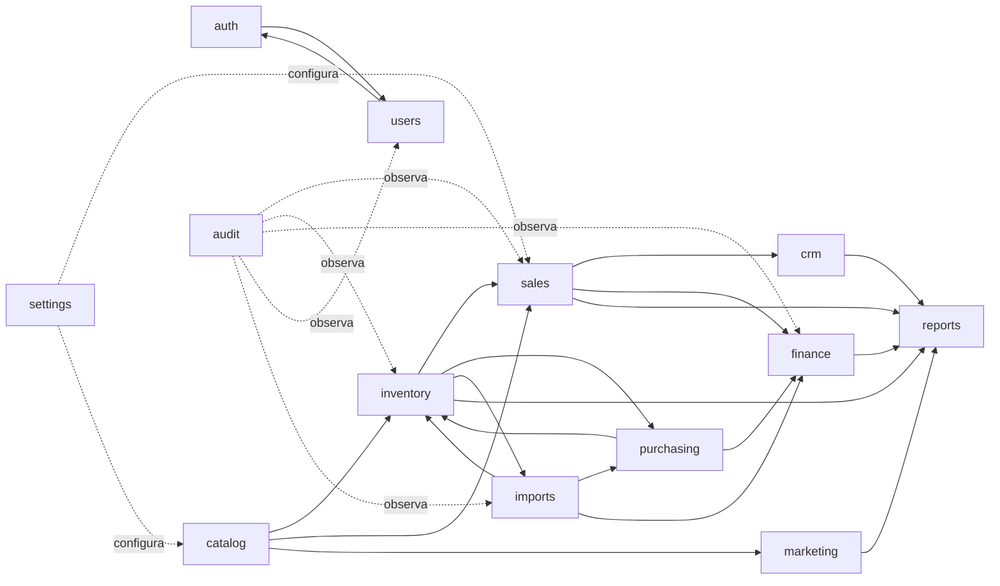

# Mapa de dominios

Define los dominios del sistema, sus responsabilidades, datos propios y dependencias permitidas.

**Estado general: ningún dominio está implementado.** Este documento define la arquitectura objetivo.

---

## Diagrama de dependencias conceptuales

---

## Dominios

### Auth

**Responsabilidad:** Autenticación de usuarios, gestión de sesiones y recuperación de acceso.

**Datos propios:**
- Credenciales (gestionadas por Supabase Auth)
- Sesiones activas
- Tokens de recuperación

**Dependencias permitidas:** `users`

**Información que NO debe poseer:**
- Datos de perfil de usuario (pertenecen a `users`)
- Permisos específicos por acción (pertenecen a `users`)

**Eventos/integraciones futuras:** Supabase Auth como proveedor de identidad.

---

### Users

**Responsabilidad:** Perfiles internos de usuarios del sistema, roles, permisos y estado.

**Datos propios:**
- Perfil (nombre, email, estado)
- Rol asignado
- Permisos individuales
- Historial de acceso

**Dependencias permitidas:** `auth`

**Información que NO debe poseer:**
- Credenciales de autenticación (pertenecen a `auth`)
- Datos de clientes externos (pertenecen a `crm`)

**Eventos/integraciones futuras:** Integración con `auth` para verificar identidad antes de asignar perfil.

---

### Catalog

**Responsabilidad:** Productos, categorías, precios, imágenes y publicación en tienda.

**Datos propios:**
- Productos (nombre, descripción, SKU, imágenes, estado)
- Categorías y jerarquía
- Precios de venta actuales
- Estado de publicación

**Dependencias permitidas:** Ninguna (dominio raíz de datos de producto)

**Información que NO debe poseer:**
- Stock disponible (pertenece a `inventory`)
- Costos de compra (pertenecen a `purchasing` / `finance`)
- Historial de precios de pedidos (pertenece a `sales`)

**Eventos/integraciones futuras:** `inventory` consulta catálogo para vincular movimientos. `sales` y `marketing` leen datos de catálogo.

---

### Inventory

**Responsabilidad:** Existencias por producto, reservas, movimientos, ajustes y alertas de stock.

**Datos propios:**
- Saldo actual por producto
- Movimientos (entrada, salida, ajuste, reserva, devolución)
- Stock en tránsito (referencia a `imports`)
- Alertas de stock mínimo

**Dependencias permitidas:** `catalog`

**Información que NO debe poseer:**
- Datos de pedidos (pertenecen a `sales`)
- Costos unitarios actualizados (pertenecen a `purchasing` / `finance`)

**Reglas invariantes:**
- El saldo nunca se modifica directamente; siempre mediante un movimiento.
- Los movimientos no se eliminan.
- Los errores se corrigen con movimientos compensatorios.

**Eventos/integraciones futuras:**
- `sales` genera movimientos de reserva y salida.
- `imports` genera movimientos de entrada al recibir mercancía.
- `purchasing` inicia movimientos al confirmar recepción.

---

### Sales

**Responsabilidad:** Carrito de compra, pedidos, líneas de pedido, estados del pedido y asociación de pagos.

**Datos propios:**
- Pedidos y su historial de estados
- Líneas de pedido con snapshot de precio y producto
- Fuente del pedido (tienda, WhatsApp, manual)
- Asociación con pagos registrados en `finance`

**Dependencias permitidas:** `catalog`, `inventory`, `crm`, `finance`

**Información que NO debe poseer:**
- Costos de productos (pertenecen a `finance` y `purchasing`)
- Datos de cliente más allá de la referencia (pertenecen a `crm`)

**Reglas invariantes:**
- Al crear un pedido, se registra un snapshot del precio de cada producto.
- Los precios históricos de pedidos son inmutables.

**Eventos/integraciones futuras:**
- Reserva de inventario al confirmar pedido.
- Liberación de reserva al cancelar.
- Generación de ingreso en `finance` al completar pago.

---

### CRM

**Responsabilidad:** Clientes, contactos, notas de seguimiento e historial comercial.

**Datos propios:**
- Clientes (nombre, contacto, canal preferido)
- Notas de seguimiento
- Historial de interacciones

**Dependencias permitidas:** `sales` (referencia de pedidos del cliente)

**Información que NO debe poseer:**
- Datos de pedidos completos (pertenecen a `sales`)
- Información financiera detallada (pertenece a `finance`)

**Eventos/integraciones futuras:** Integración con canal de WhatsApp para registro de contactos.

---

### Purchasing

**Responsabilidad:** Proveedores, órdenes de compra y recepción de mercancía local.

**Datos propios:**
- Proveedores y datos de contacto
- Órdenes de compra con líneas y precios de costo
- Estado de recepción

**Dependencias permitidas:** `catalog`, `inventory`, `finance`

**Información que NO debe poseer:**
- Datos de pedidos de clientes (pertenecen a `sales`)
- Datos de importación detallados (pertenecen a `imports`)

**Eventos/integraciones futuras:** Al recibir una orden de compra, se genera un movimiento de entrada en `inventory` y un gasto en `finance`.

---

### Imports

**Responsabilidad:** Importaciones internacionales, mercancía en tránsito, gastos asociados y recepción.

**Datos propios:**
- Importaciones con estado de seguimiento
- Productos incluidos y cantidades
- Transportista, tracking, fechas estimadas y reales
- Gastos de importación (aduana, flete, etc.)
- Capital comprometido
- Faltantes y daños al recibir

**Dependencias permitidas:** `purchasing`, `inventory`, `finance`

**Información que NO debe poseer:**
- Datos de ventas (pertenecen a `sales`)
- Clientes (pertenecen a `crm`)

**Eventos/integraciones futuras:** Al cerrar una importación, se generan movimientos de entrada en `inventory` y se distribuyen gastos en `finance`.

---

### Finance

**Responsabilidad:** Ingresos, gastos, pagos, flujo de caja y rentabilidad.

**Datos propios:**
- Registros de ingresos (con referencia a pedidos)
- Registros de gastos (con referencia a compras, importaciones, marketing, etc.)
- Métodos de pago registrados
- Flujo de caja por período
- Rentabilidad por producto y período

**Dependencias permitidas:** `sales`, `purchasing`, `imports`, `marketing`

**Información que NO debe poseer:**
- Detalles operativos de pedidos o importaciones (solo referencias)

**Reglas invariantes:**
- Los registros financieros históricos no se eliminan.
- Los errores se corrigen con registros compensatorios.
- Los costos y rentabilidad son información restringida.

---

### Marketing

**Responsabilidad:** Campañas publicitarias, inversión, atribución de pedidos y rentabilidad post-publicidad.

**Datos propios:**
- Campañas (plataforma, objetivo, fechas, presupuesto)
- Gasto real por campaña
- Productos promocionados
- Pedidos atribuidos
- Costo por pedido / costo por venta

**Dependencias permitidas:** `sales`, `catalog`

**Información que NO debe poseer:**
- Datos de clientes individuales (pertenecen a `crm`)
- Información financiera de costos (pertenece a `finance`)

**Nota:** El módulo de marketing controla inversión y resultados; **no es una herramienta de publicación en redes sociales**.

---

### Reports

**Responsabilidad:** Agregación de indicadores y generación de reportes operativos.

**Datos propios:** Ninguno. Solo lee y agrega datos de otros dominios.

**Dependencias permitidas:** `sales`, `inventory`, `finance`, `marketing`, `crm`, `purchasing`, `imports`

**Información que NO debe poseer:** Datos originales (solo vistas agregadas).

**Eventos/integraciones futuras:** Posible exportación a CSV/PDF.

---

### Audit

**Responsabilidad:** Trazabilidad de operaciones sensibles en todos los dominios.

**Datos propios:**
- Log de operaciones (quién, qué, cuándo, sobre qué entidad)
- Cambios de estado en pedidos, inventario, finanzas y usuarios

**Dependencias permitidas:** Observa todos los dominios, solo lectura.

**Restricciones:**
- Los registros de auditoría son inmutables.
- Solo administradores pueden consultarlos.

---

### Settings

**Responsabilidad:** Configuración general del negocio (nombre, moneda, datos de contacto, parámetros operativos).

**Datos propios:**
- Parámetros de configuración global
- Datos del negocio (nombre, RIF, dirección, WhatsApp)
- Moneda y formato numérico

**Dependencias permitidas:** Ninguna de dominio.

**Información que NO debe poseer:** Datos transaccionales ni historial operativo.
