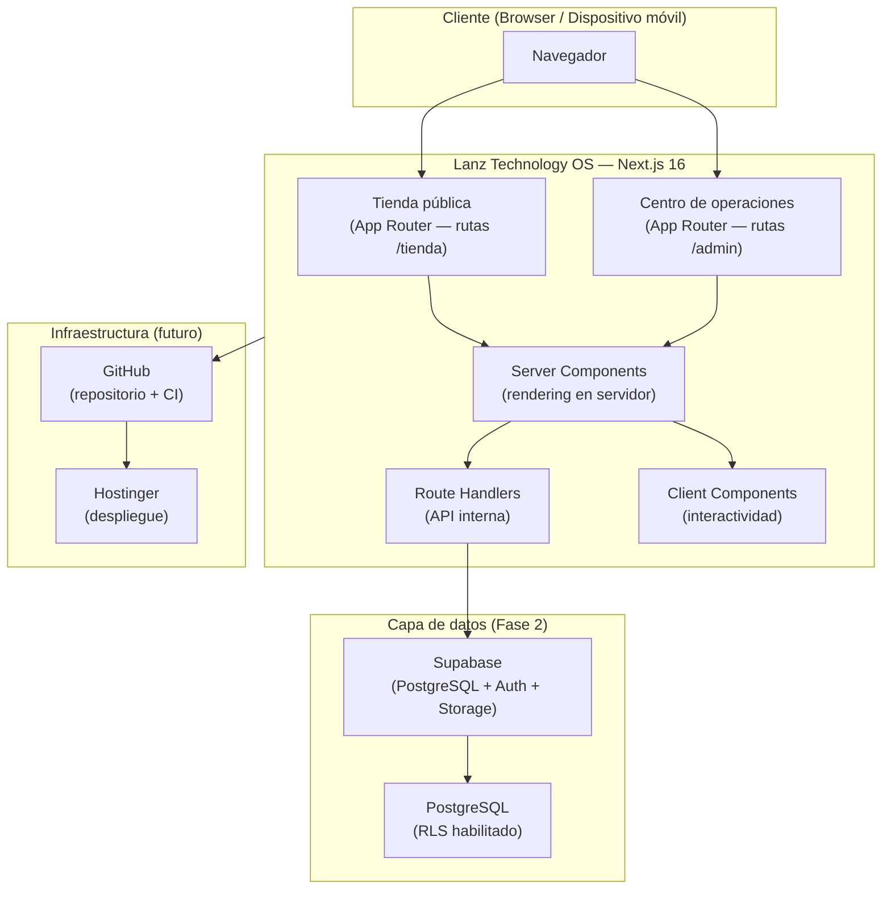

# Arquitectura general del sistema

Visión de alto nivel de la arquitectura de Lanz Technology OS.

---

## Modelo general

Lanz Technology OS es un **monolito modular** construido sobre Next.js con App Router.

La aplicación opera como un sistema full-stack unificado que sirve tanto la tienda pública como el centro de operaciones interno. En esta etapa, no existe separación en microservicios.

Consultar [`ADR-002-modular-monolith.md`](../decisions/ADR-002-modular-monolith.md) para la justificación de esta decisión.

---

## Diagrama de alto nivel



---

## Superficies de la aplicación

### Tienda pública

- Orientada a clientes finales.
- Catálogo de productos, categorías, imágenes y precios.
- Carrito de compra y proceso de pedido.
- Información de contacto y canal de WhatsApp.
- SEO, rendimiento y accesibilidad prioritarios.
- Acceso sin autenticación (salvo área de cuenta de cliente en fases futuras).

### Centro de operaciones

- Exclusivo para usuarios internos autenticados.
- Gestión de inventario, pedidos, importaciones, finanzas y reportes.
- Control de usuarios, roles y permisos.
- Acceso restringido por autenticación y permisos por acción.
- Diseño orientado a eficiencia operativa, no a marketing.

---

## Stack técnico

| Capa | Tecnología | Estado |
|---|---|---|
| Framework | Next.js 16 (App Router) | Activo |
| UI | React 19, Tailwind CSS 4 | Activo |
| Tipado | TypeScript 5 (strict) | Activo |
| Linting | ESLint 9 | Activo |
| Base de datos | PostgreSQL (vía Supabase) | Fase 2 |
| Auth | Supabase Auth | Fase 3 |
| Storage | Supabase Storage | Fase 4+ |
| Repositorio | GitHub | Futuro |
| Despliegue | Hostinger | Futuro |

---

## Separación de responsabilidades

```
Presentación          →  app/ (layouts, pages, components)
Casos de uso          →  features/<dominio>/actions/ o services/
Reglas de negocio     →  features/<dominio>/domain/
Acceso a datos        →  features/<dominio>/data/ o lib/db/
Tipos compartidos     →  types/
Utilidades globales   →  lib/
Configuración         →  config/
```

No implementado aún. Esta estructura se creará progresivamente al desarrollar cada módulo.

---

## Comunicación entre dominios

- Los dominios se comunican a través de interfaces y tipos compartidos, no por acceso directo a funciones internas del otro dominio.
- Un dominio nunca importa directamente desde la carpeta interna de otro.
- La comunicación entre dominios con efectos secundarios (ej. inventario al recibir un pedido) se manejará mediante funciones de servicio explícitas o eventos internos.

---

## Dependencias permitidas entre dominios

```
sales       → catalog, inventory, crm, finance
inventory   → catalog
purchasing  → catalog, inventory, finance
imports     → purchasing, inventory, finance
finance     → sales, purchasing, imports
marketing   → sales, catalog
reports     → sales, inventory, finance, marketing, crm
audit       → (todos los dominios, solo lectura de eventos)
settings    → (sin dependencias de dominio)
auth        → users
users       → auth
```

---

## Dependencias a evitar

- Componentes de UI que acceden directamente a la base de datos.
- Dominios que importan módulos internos de otros dominios.
- Dependencias circulares entre dominios.
- Lógica de negocio en archivos de configuración o layouts.
- Server secrets en variables `NEXT_PUBLIC_`.

---

## Estrategia de crecimiento

1. Construir módulo por módulo según el roadmap.
2. Cada módulo vive en su propio directorio dentro de `features/`.
3. Los módulos comparten tipos y utilidades desde `types/` y `lib/`.
4. La separación de dominios se mantiene desde la primera línea de código.
5. Si un módulo crece lo suficiente, puede extraerse como servicio independiente sin romper la arquitectura base.

---

## Notas sobre despliegue en Hostinger

El método exacto de despliegue dependerá del plan contratado y su soporte para aplicaciones Node.js. Será definido en la Fase de Infraestructura. Por ahora, Next.js genera un build estándar compatible con plataformas Node.js.
